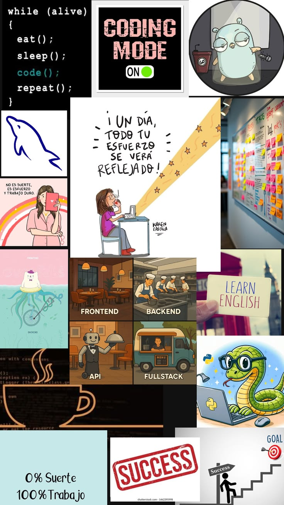

# 🚀 Zully Tamayo | Full Stack Developer Portfolio

¡Bienvenido/a a mi portafolio profesional! Este proyecto es una vitrina de mi evolución como desarrolladora, enfocada en la creación de soluciones robustas, escalables y eficientes, con una fuerte pasión por el **Backend** y la infraestructura **Cloud**.

---

## 👩‍💻 Sobre mí
Soy una desarrolladora en formación constante, actualmente fortaleciendo mis habilidades en el ecosistema **Java, JavaScript y Go**. Mi enfoque se centra en la arquitectura de microservicios y la integración de datos, siempre bajo metodologías ágiles (**SCRUM**).

* ☁️ En proceso de certificación **AWS Cloud Practitioner**.
* ⚙️ Experiencia en integración de APIs y gestión de bases de datos (**PostgreSQL**).
* 🚀 Comprometida con el código limpio y el aprendizaje continuo.

---

## 🎨 ADN Visual (Moodboard)
Para la concepción de este portafolio, definí una identidad basada en la lógica, el esfuerzo y la modernidad tecnológica. Mi inspiración combina el "Dark Mode" con acentos vibrantes que representan la energía del código.

> **Puedes ver mi proceso de inspiración aquí:**
> 

* **Paleta de Colores:** Negro Profundo, Púrpura Eléctrico y Azul Tecnológico.
* **Concepto:** Minimalismo funcional y enfoque en el rendimiento.

---

## 🛠️ Stack Tecnológico
* **Lenguajes:** Java, Go, Python, JavaScript.
* **Frontend:** HTML5, CSS3, Bootstrap 5.
* **Backend & DB:** Spring Boot, Gin Gonic, PostgreSQL.
* **Herramientas:** Git, GitHub, Jira, Docker.

---

## 📁 Proyectos Destacados
1.  **Historias de Café:** Plataforma digital que conecta a productores regionales de café con mercados globales.
2.  **ABC Challenge:** Aplicación interactiva de aprendizaje infantil (Flashcards) desarrollada con JS Vanilla y Bootstrap.
3.  **Integración HubSpot-PostgreSQL:** Script en Python para la automatización de flujos de trabajo y analítica en Looker Studio.

---

## 🌐 Despliegue
Puedes ver la versión en vivo de mi portafolio aquí:
🔗 [https://phenomenal-eclair-9360d4.netlify.app/](https://phenomenal-eclair-9360d4.netlify.app/)

---

## 📫 Contacto
* **LinkedIn:** [LinkedIn](https://www.linkedin.com/in/zully-tamayo-martinez-softwaredeveloper/)
* **GitHub:** [@ZullyTamayoM](https://github.com/ZullyTamayoM)

---
*Hecho con 100% trabajo y 0% suerte.*